# Letterboxd Morphe Patches

<div align="center">

Small, cosmetic patches for the **Letterboxd** Android app (`com.letterboxd.letterboxd`),
built for [Morphe](https://morphe.software).

[](https://www.gnu.org/licenses/gpl-3.0)
[](https://morphe.software)
[](https://android.com)


</div>

---

## About

A personal collection of resource-only patches for Letterboxd on Android — theming
and layout tweaks, nothing more. No behaviour changes, no unlocking, no ad or
tracking work, no network changes.

Every patch is opt-in and independent. Theme options (surface colour, accent,
bottom-nav style) live in the in-app **Mod settings** screen rather than in the
patcher.

Not affiliated with Letterboxd or the Morphe project.

---

## Screenshots

Every shot is the same film page / home screen, changing only the setting.

### Material You — surface style

The two "Wallpaper tint" columns are two different device wallpapers — the dark
chrome tracks whatever palette Android hands it.

| | Wallpaper tint A | Wallpaper tint B | Pure black (OLED) |
| :--- | :---: | :---: | :---: |
| **Film page** | 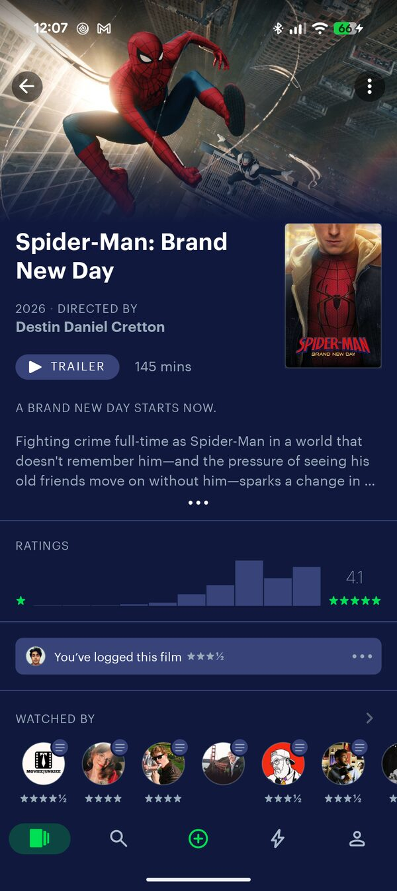 |  | 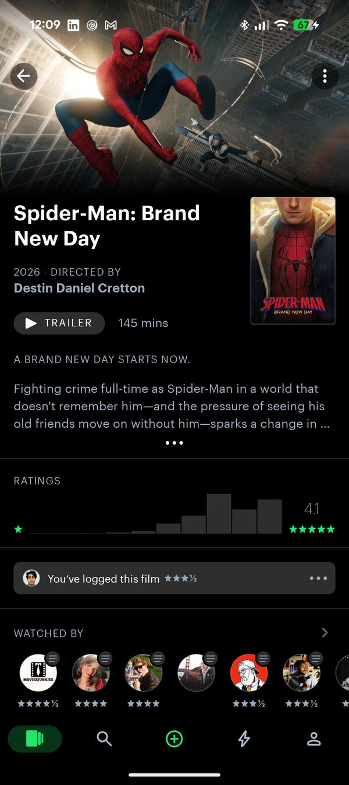 |
| **Home** | 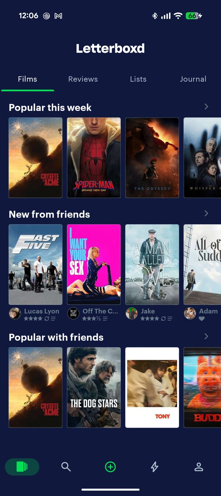 |  |  |

### Accent colour

Same film page, OLED surface — a preset swatch or any hex. Visible on the ratings
histogram and the selected bottom-nav tab.

| Letterboxd green | Amber | Blue |
| :---: | :---: | :---: |
|  |  |  |

### Bottom nav selected style

The green **+** button is untouched in every mode.

| Stock — grey pill, blue icon | No pill, white icon |
| :---: | :---: |
| 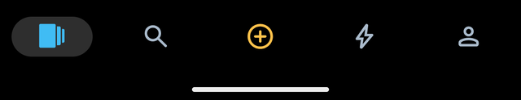 | 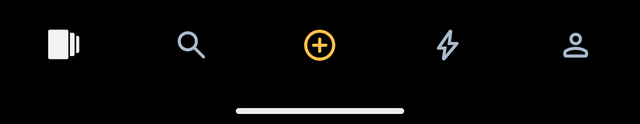 |

| No pill, accent icon | Accent pill |
| :---: | :---: |
|  |  |

### Denser poster grid

| Cozy | Dense |
| :---: | :---: |
| 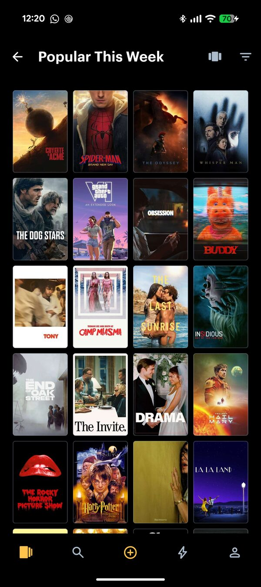 | 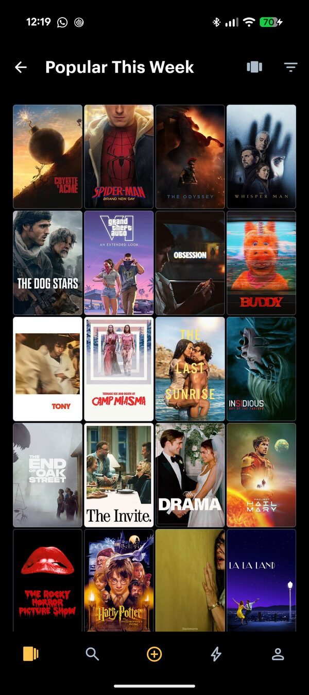 |

### Hide Video Store on home

| Before | After |
| :---: | :---: |
| 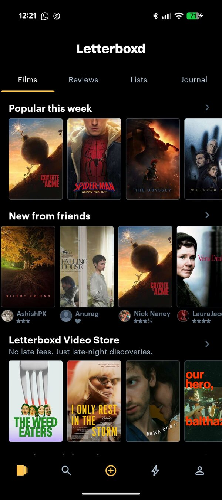 | 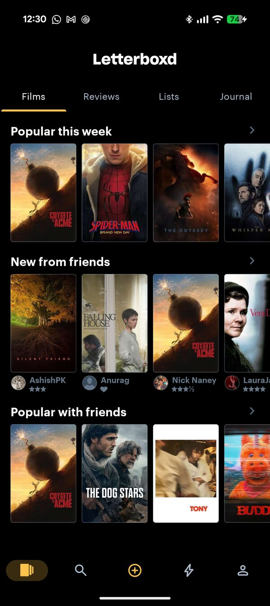 |

### Hide ratings until watched

The film's community rating is fully covered until you tap. 
| Shimmer | Frosted panel | Tap to burst | Tap-to-show link |
| :---: | :---: | :---: | :---: |
| 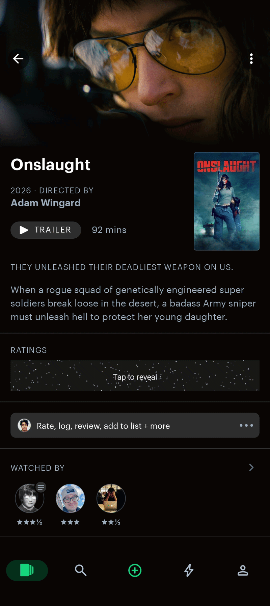 |  | 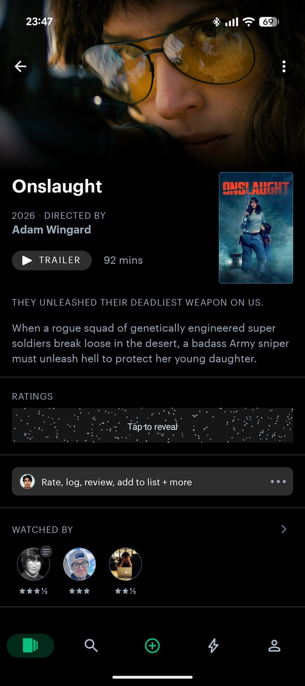 |  |


---

## Install

1. On the device, open this link to add the source in Morphe Manager:
   <https://morphe.software/add-source?github=mvaishak/letterboxd-morphe-patches>
2. In the source settings, enable **pre-releases** for the newest (`dev`) builds,
   or leave it off for stable releases only.
3. Load a clean, unpatched Letterboxd APK from
   [APKMirror](https://www.apkmirror.com/apk/letterboxd/) or
   [Uptodown](https://letterboxd.en.uptodown.com/android) — not a file another
   tool has already patched or re-zipped.
4. Select the patches you want and patch.

> **Opening the Mods screen.** With the **Mod settings** patch enabled, everything
> configurable lives in an in-app screen — reach it by **long-pressing the
> Letterboxd app icon** on your home screen, or **long-pressing the settings gear
> on your profile tab**. A one-time note explaining this also shows on first
> launch after patching.

Current target: **Letterboxd 3.5.4 (496)**. Other versions may work; Morphe warns
on a mismatch.

---

## Patches

<!-- PATCHES_START EXPANDED -->
> **[v1.5.0](https://github.com/mvaishak/letterboxd-morphe-patches/releases/tag/v1.5.0)**&nbsp;&nbsp;•&nbsp;&nbsp;`main`&nbsp;&nbsp;•&nbsp;&nbsp;6 patches total
<details open>
<summary>Letterboxd&nbsp;&nbsp;•&nbsp;&nbsp;6 patches</summary>
<br>

**Supported versions:**

| 3.5.4 |
| :---: |

| Patch | Description | Options |
|----------|----------------|-----------|
| [Brighter Watched-by stars](#brighter-watched-by-stars) | Other people's star ratings in a film's "Watched by" row use a very dark grey (#445566) that is hard to read, especially on a black theme. This switches them to the lighter grey (#99AABB) the rest of the app already uses for other people's ratings. A small legibility fix, on by default. |  |
| [Denser poster grid](#denser-poster-grid) | Tightens the spacing around posters in grids so they render larger and closer together. Does not change the number of columns. | • Grid density |
| [Hide Video Store on home](#hide-video-store-on-home) | Removes the "Letterboxd Video Store" promo row from the Films tab. The Video Store itself, its settings and every other entry point are left untouched. |  |
| [Hide ratings until watched](#hide-ratings-until-watched) | Hides the community rating (average + histogram) on a film's page until you have marked that film as watched, covering it with a tap-to-reveal control. The reveal is per visit — leave the film and come back and it is hidden again. Only the film page is affected; ratings shown in lists, search and elsewhere are unchanged. | • Reveal style |
| [Match bottom nav to top bar color](#match-bottom-nav-to-top-bar-color) | Sets Letterboxd's bottom navigation bar background to the same color as the top bar (@color/black100), so it blends into the app's dark chrome instead of showing the default slate bar. |  |
| [Material You theme](#material-you-theme) | Repaints Letterboxd's dark chrome — window background, surfaces, cards, the top bar, tab strip and bottom nav. 'Wallpaper tint' follows the device's Material You palette on Android 12+ (no effect below). 'Pure black (OLED)' forces true black on any version. Optional accent colour recolours Letterboxd's green; optional bottom-nav selected style replaces the grey pill. No effect on Jetpack Compose screens. Overlaps "Match bottom nav to top bar color" — enable one, not both. | • Surface style<br>• Accent colour<br>• Bottom nav selected style |

</details>

<!-- PATCHES_END -->

> The table above, between the `PATCHES_START` / `PATCHES_END` markers, is
> regenerated on every release. Don't edit it by hand.

### Details

**Mod settings** — *on by default*

Adds a **Letterboxd Mods** screen that collects the other patches' options so you
can change them in the app instead of re-patching.

> **HOW TO OPEN IT:** long-press the **Letterboxd app icon** on your home screen,
> **or** long-press the **settings gear on your profile tab**. (A one-time note
> also appears on first launch after patching.)

Some changes apply immediately (e.g. hide-ratings reveal style); others need a
restart — you're always prompted. The theme controls also need **Appearance**
enabled.

**Appearance** — *on by default, Android 12+*

Repaints Letterboxd's dark surfaces and green accent at runtime via resource
overlays, driven from **Mod settings**:

- **Surface style** — *Default* or *Pure black (OLED)* (elevated surfaces stay a
  faint grey so histogram bars don't disappear). Locked while the separate
  **Material You theme** patch is enabled.
- **Accent colour** — presets or a full HSV / hex picker; recolours the stars,
  rating indicators and primary buttons.
- **Bottom nav selected style** — *Stock*, *No pill*, *No pill + white icon*,
  *No pill + accent icon*, or *Accent pill*. The green "+" is never touched.

Only the named surface / accent colour resources change — no Jetpack Compose
screens, no app-bar style flattening.

**Match bottom nav to top bar colour** — *on by default*

Makes the bottom navigation bar black, matching the top bar. Toggleable from
**Mod settings**.

**Denser poster grid** — *opt-in*

Tightens the spacing around posters so they render larger and closer together.
Does not change the column count.

- **Grid density** — Cozy, Compact (default), or Dense.

**Hide Video Store on home** — *opt-in*

Removes the "Letterboxd Video Store" promo row from the Films tab. The Video Store
and every other entry point (settings, film pages, search) are left alone.

**Hide ratings until watched** — *opt-in*

Hides the community rating (average + histogram) on a film's page until you've
marked that film as watched. The section keeps its title and a tap-to-reveal
control takes the place of the rating; the reveal lasts for the current visit,
so leaving the film and coming back hides it again. Only the film page is
affected — ratings in lists, search and "similar films" are unchanged. If the
watched state can't be read for any reason it fails open (ratings stay visible).

- **Reveal style** — *Frosted panel* (default; an opaque panel with an eye glyph
  and a "Tap to reveal" label), *Tap-to-show link* (a plain text link under the
  section title), *Shimmer* (a Telegram-style particle field that animates until
  tapped) or *Tap to burst* (a static particle field that scatters on tap). Every
  style fully covers the rating — nothing shows through until you tap.

**Brighter Watched-by stars** — *on by default*

Switches other people's star ratings in a film's "Watched by" row from a
near-unreadable dark grey (`#445566`) to the lighter grey (`#99AABB`) the rest of
the app uses for other people's ratings. A small legibility fix, applied
regardless of which theme patch (if any) you use.

## Building

Requires a JDK 21 and the Android SDK (platform 36, build-tools 36).

```bash
./gradlew buildAndroid
```

The bundle is written to `patches/build/libs/patches-*.mpp`; apply it with
[Morphe Desktop](https://github.com/MorpheApp/morphe-desktop). See the
[Morphe documentation](https://github.com/MorpheApp/morphe-documentation) for more.

---

## Releasing

Handled by `release.yml` and semantic-release. Do not tag or upload releases by
hand, and do not edit the generated files (`patches-list.json`,
`patches-bundle.json`, `CHANGELOG.md`, or the patch table above).

- Work on the **`dev`** branch with
  [conventional commits](https://www.conventionalcommits.org): `feat:` and `fix:`
  cut a pre-release; `chore:` and `docs:` do not.
- Pushing to `dev` builds a pre-release and opens a `dev` to `main` pull request.
- Merge that pull request with a merge commit (not squash) to cut a stable
  release.

---

## License

[GNU General Public License v3.0](LICENSE). See [NOTICE](NOTICE) for Morphe's
additional conditions under GPLv3 Section 7.
